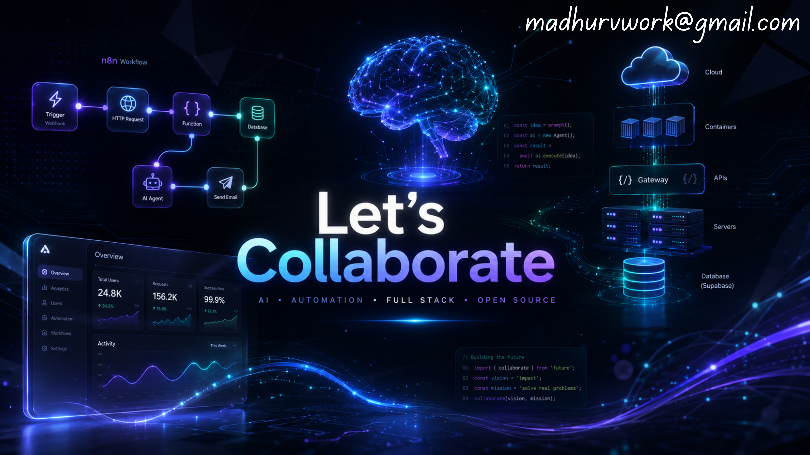

# 💫 About Me:
👋 Hey, I'm Madhur   I enjoy building products that solve real-world problems—from enhancing ERP platforms to creating intelligent AI workflows.  Currently working as a Product Developer for an ERP product, where I bridge business needs with scalable software solutions.  ✨ Current Mission  Building AI-powered workflows that don't just automate tasks—they collaborate, reason, and create value.  ✨ Philosophy  "Great software isn't just about writing code—it's about designing experiences that make complex work feel effortless."  📫 Always open to collaborating on AI, automation, full-stack projects, and innovative product ideas. Let's build something meaningful! 🚀

## 🌐 Socials:
    

# 💻 Tech Stack:
          
# 📊 GitHub Stats:
 
 

## 🏆 GitHub Trophies

### 🔝 Top Contributed Repo

---

<!-- Proudly created with GPRM ( https://gprm.itsvg.in ) -->
